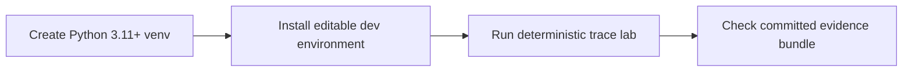

# K2DO — evidence-led DeepThink orchestration for K2

K2DO adapts the MIT-licensed
[HKUDS/nanobot](https://github.com/HKUDS/nanobot) runtime for K2 Think/Instruct
models and adds a K2-specific reasoning control plane: deterministic query
routing, concurrent role-configured thinker calls, model fallback, bounded
timeouts, judge synthesis, and cancellation cleanup.

> [!IMPORTANT]
> K2DO is a modified derivative, not a from-scratch agent framework. The
> generic message bus, tool shell, persistence, scheduling, provider
> abstractions, and Telegram transport descend from nanobot. The contribution
> boundary is documented in the
> [provenance and contribution map](docs/provenance.md).

This README starts with the credential-free path that can be checked today.
Live K2 setup comes later and is deliberately not presented as benchmark
evidence.

## Run the verified offline path

The offline lab calls the production `classify_query` function and a direct
`DeepThinkEngine` instance against a strict scripted provider. It needs no API
key and does not send model requests.



```bash
python3 -m venv .venv
. .venv/bin/activate
python -m pip install -e '.[dev]'

python -m k2do.labs.deepthink_trace
python -m pytest -q tests/test_deepthink_trace_lab.py tests/test_trace_evidence_recorder.py
python -m k2do.labs.trace_evidence_recorder check
```

The setup is supported on CPython 3.11 or newer. It is not yet byte-for-byte
environment reproducible: dependencies have lower bounds and the repository
has no lockfile. The committed capture records the Python, OS, architecture,
and K2DO distribution version that produced it.


*Genuine captured stdout rendered from the canonical receipt. The payload
contains labels, counts, and digests—not prompts, model responses, credentials,
endpoints, absolute paths, or timing claims. Receipt SHA-256:
`f66e1db30dd79d77318a20ae86a0aa450a663e8f5cdff351557ca6fd1d0da80d`.*

## Observed orchestration workflow


*Receipt-derived synthesis path through the production router and direct
`DeepThinkEngine`. The strict synthetic provider forces an Analyst primary
error and fallback, a Pragmatist timeout/cancellation path, and a Judge call
after every selected thinker is terminal. This is control-flow evidence, not an
answer-quality or latency claim.*

The canonical receipt covers these deterministic scenarios:

| Scenario | What was observed |
| --- | --- |
| Router contract | The complex architecture fixture routes to `deepthink`; the simple greeting fixture routes to `simple`. |
| Synthesis path | Three of four configured thinkers are selected; provider-call peak is 3; Analyst primary fails then fallback succeeds; Pragmatist reaches the categorical timeout path; Judge runs after all selected thinkers are terminal; cleanup ends with 0 active calls. |
| Judge degradation | Provider-call peak is 2; Judge primary and model fallback both error; the engine returns the longest successful synthetic thinker response; cleanup ends with 0 active calls. |
| Caller cancellation | Three blocked provider calls are cancelled; Judge call count is 0; the root task is cancelled; cleanup ends with 0 active calls and 0 incomplete barriers. |

The word “thinker” here means a concurrent, role-configured call through one
provider abstraction. The lab does not claim separate autonomous processes or
independent model backends.

## Measured properties


*All values are derived from the same receipt. Peaks `3 / 2 / 3` describe the
three scripted scenarios, not throughput. The Judge-degradation result is the
longest successful synthetic response, not a measured “best” answer.*

The evidence recorder makes the visuals reviewable rather than decorative:

- it materializes a private snapshot from committed Git blobs and runs that
  snapshot with `python -I -S -B`;
- it binds ten capture-relevant committed paths—the lab/engine modules,
  recorder, package initializers, and project metadata—by Git mode, blob ID,
  SHA-256, and byte count;
- it records zero observed communication syscalls in one Linux `strace` run
  over an explicit syscall set; this is an observation, not network isolation;
- it checks exact file sets, hashes, media types, JSON structure, explicit
  forbidden SVG patterns, and the SVG root contract;
- it deterministically re-renders the transcript and visuals during
  `trace_evidence_recorder check`.

See the [evidence protocol and boundaries](docs/evidence.md) and the
[machine-readable manifest](docs/deepthink-trace-evidence/manifest.json).

## Technical decisions

| Concern | Implementation | Evidence boundary |
| --- | --- | --- |
| Query routing | Deterministic heuristic score in `k2do/agent/router.py` | Two fixed route decisions are captured; general routing accuracy is not measured. |
| Parallel work | Selected role configurations run concurrently with `asyncio.gather` | Barrier order and peak active provider calls are captured. |
| Model fallback | A failed primary call retries once on the configured fallback model | Thinker fallback and double Judge failure are forced by the strict provider. |
| Time bounds | Thinker and Judge calls are wrapped with `asyncio.wait_for` | A categorical thinker timeout is captured; elapsed time is intentionally excluded. |
| Cancellation | Caller cancellation propagates through active thinker calls | Cancelled-call counts and zero-active cleanup are captured. |
| Judge degradation | If Judge execution fails, the longest raw thinker response is selected; a fixed message is used if that selected response is blank | The deterministic successful-response selection is captured; semantic quality is not assessed. |
| Evidence integrity | Source-bound receipt, deterministic renderer, atomic no-replace publication | Adversarial tests cover dirty or changing sources, artifact tampering/symlinks/extras, hostile output leaves, publish races, output caps, timeout cleanup, and squash-safe verification. |

## What is and is not verified

| Surface | Current evidence |
| --- | --- |
| Default `classify_query` behavior for two fixed fixtures | Verified by the offline receipt |
| Direct `DeepThinkEngine` concurrency, fallback, timeout, Judge degradation, and cancellation | Verified by the offline receipt |
| Artifact provenance and deterministic rendering | Verified by the committed manifest and checker |
| AgentLoop automatic handoff and configuration wiring | Covered in parts by unit tests; outside this receipt |
| Tool execution, refinement, memory, gateway, and Telegram paths | Present in the repository; outside this receipt |
| Live K2 provider behavior | Not captured |
| Answer quality, token cost, throughput, or latency | Not benchmarked |
| Locked dependency environment and CI | Not yet available |

## Optional live K2 setup

This credentialed configuration path can incur provider usage. It is not part
of the offline evidence above.

```bash
k2do onboard
# Add your key to ~/.k2do/config.json; never commit that file.
k2do status
k2do agent -m "Compare two deployment designs and state the trade-offs."
```

The generated config uses this shape:

```json
{
  "providers": {
    "k2Think": {
      "apiKey": "<K2_API_KEY>",
      "apiBase": "https://build-api.k2think.ai/v1"
    },
    "k2Instruct": {
      "apiKey": "<K2_API_KEY>",
      "apiBase": "https://build-api.k2think.ai/v1"
    }
  },
  "agents": {
    "defaults": {
      "model": "k2-think-v2/LLM360/K2-Think-V2",
      "fallbackModel": "k2-v2-instruct/LLM360/K2-V2-Instruct"
    },
    "deepthink": {
      "enabled": true,
      "complexityThreshold": 0.45,
      "maxAgents": 3
    }
  }
}
```

Interactive commands include `/deepthink <query>` and `/refine <query>`.
`k2do gateway` starts the configured channel gateway. No credentialed output,
live-provider result, Telegram exchange, or full-screen dashboard image is used
as portfolio evidence yet.

## Repository map

```text
k2do/
  agent/
    router.py                  # deterministic query classification
    deepthink.py               # thinker concurrency, fallback, Judge, cleanup
    loop.py                    # generic/adapted runtime integration
    refine.py                  # three-stage refinement path
  labs/
    deepthink_trace.py         # strict offline provider and canonical receipt
    trace_evidence_recorder.py # source-bound capture and visual renderer
  cli/                         # Typer/Rich live interface
  channels/                    # adapted channel integrations
docs/
  deepthink-trace-evidence/    # committed receipt, manifest, transcript, SVGs
  evidence.md                  # verification and maintenance protocol
  provenance.md                # upstream/contribution boundary
tests/                         # unit and adversarial evidence tests
```

The next evidence milestones are a locked dependency set with CI, an
AgentLoop/config integration receipt, deterministic refinement/tool traces, and
an opt-in sanitized live-provider capture. They are tracked as remaining work,
not described as completed features.

## License and attribution

K2DO is distributed under the MIT License. The repository preserves the
nanobot contributors’ notice; see [LICENSE](LICENSE) and
[docs/provenance.md](docs/provenance.md) before evaluating or reusing the
project.
